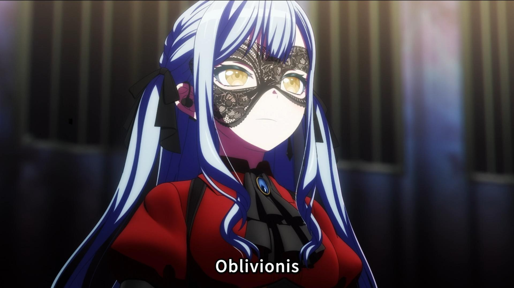

# Oblivionis

**我，毋畏遺忘！**



## 遊戲簡介

你有像Oblivionis一樣對抗遺忘的決心嗎？

在遊戲中，每一關的盤面都會延續上一關的狀態，正如Oblivionis試圖遺忘過去，但過去的陰影卻不斷籠罩著她的生活

請在這樣的世界觀不斷奮鬥，體驗Oblivionis內心的掙扎與成長。但是，**你有且僅有一次機會**

## 安裝與運行

1. **下載遊戲壓縮包**：目前遊戲僅支援Linux作業系統。在本頁面下載最新版本的遊戲壓縮資料夾，或是使用指令

```shell
git clone https://github.com/BennyNTHU/Oblivionis.git
```

下載資料夾

2. **解壓縮**：使用解壓縮工具將壓縮包內容解壓至指定文件夾。如果是使用`git clone`下載，則可以略過此步

3. **運行遊戲**：打開終端機並進入遊戲目錄，輸入 `./oblivionis` 啟動遊戲

## 遊戲玩法

1. 使用左右方向鍵移動方塊，上鍵旋轉方塊，下鍵加速方塊落下

2. 遊戲一共有十關。隨著關卡數增加，方塊下落的速度將會增快

3. 每一關的最終盤面都會保留到下一關，象徵Oblivionis揮之不去的過去。究竟這將會把他引向救贖，還是毀滅？
